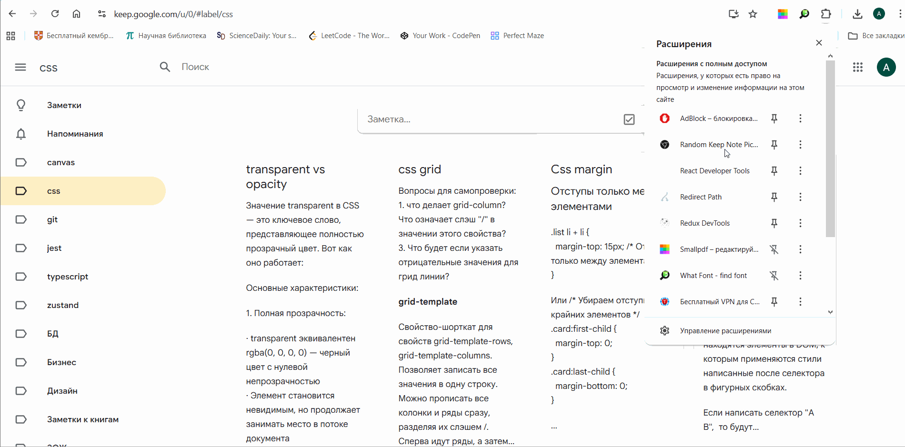

# Random Keep Note

Расширение для выбора случайной заметки в Google Keep для повторения конспектов

## Демо работы приложения

## Возможности

- находит случайную заметку по введенному ярлыку
- автоматически подставляется ярлык из поля url
- можно запускать с помощью клавиши Enter
- можно закрывать popup окно
- не требуется авторизация

## Использование

На данный момент расширение не поставляется в Интернет-магазин Chrome
